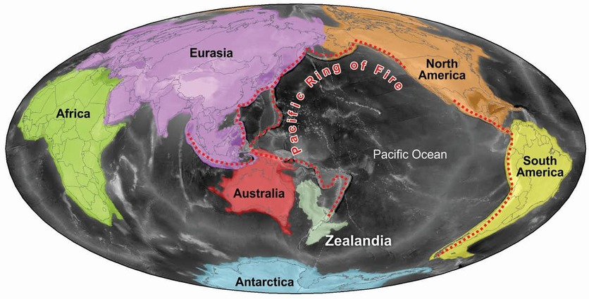
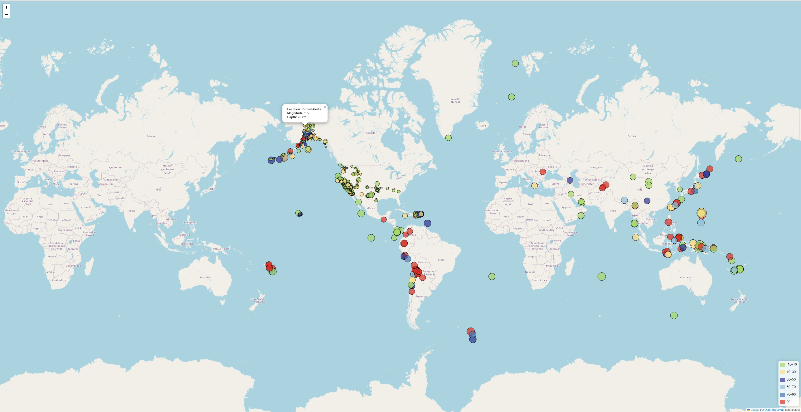

# USGS_Earthquake_Visualizations
 USGS Earthquake Visualization is an open-source project that provides an interactive map to visualize earthquake data collected by the USGS, highlighting the relationship between tectonic plates and seismic activity. Built with JavaScript, Leaflet.js, D3.js, HTML, and CSS, the project is available on GitHub under the MIT License.

### USGS Earthquake Visualizations

Hi, let's display the  data visualizations with an interactive web-based map to visualize earthquake data collected by the United States Geological Survey (USGS), highlighting the relationship between tectonic plates and seismic activity.

### 1 Introduction 

The USGS is aims to provide scientific data about natural hazards, the health of our ecosystems and environment, and the impacts of climate and land-use change. They collect a vast amount of earthquake data from around the world daily. This project aims to develop a visualization tool for USGS data, allowing them to better educate the public and other government organizations on issues facing our planet.

### 2 Prerequisites

Before you begin, ensure you have the following installed:

HTML, CSS ( for structure and style web page)

JavaScript ( for dynamic behavior)

D3.js ( for data manipulation)

Leaflet.js ( for interactive maps )

### 3 Data Sources

We used the two data scources:

To visualize an earthquake dataset [USGS GeoJSON Feed](https://earthquake.usgs.gov/earthquakes/feed/v1.0/geojson.php)

To visualize realtionships between tectonic plates and seismic activities [Tectonic Plates Dataset](https://github.com/fraxen/tectonicplates)

### 4 Features

Leaflet-based interactive map.

Visualization of earthquake data based on longitude and latitude.

Data markers reflecting earthquake magnitude (size) and depth (color).

Popups with additional information about each earthquake.

Map legend providing context for the data.

Visualization of tectonic plates dataset.

Multiple base maps and overlays.

Layer controls for independent toggling of datasets.

### 5 Execution with D3.js and Leaflet.js

We performed the following operations for the logic.js in both the folders "Leafelt-Part-1" and "Leafelt-Part-1":

- Using Leaflet, create a map that plots all the earthquakes from your dataset based on their longitude and latitude.

- Include popups that provide additional information about the earthquake when its associated marker is clicked.

- Create a legend that will provide context for your map data.

Additionally, to plot the tectonic plates and seismic activities, we added the follwoing operations:

- Plotted the tectonic plates dataset on the map in addition to the earthquakes.

- Added the gray sclae, outdoor , and satellite base maps.

- Put each dataset into separate overlays that can be turned on and off independently.

- Added layer controls to your map.

### 7 Earthquake Data Visulaizations

At a glance , there is the earthquake visualiations where the set view is pinned at Ontario, Canada.

### 8 Visulaizations of Relationship b/w Tectonic Plates & Seismic Activities

Below is a glimpse of how the realtionship between tectonic plates and seismic activities looks like:

### 9 Usage

We can visualize the data on the map for earthquakes details and the relationships between tectonic plates and seismic activities.

### 10 Deployment

This dashboard is deployed on [GitHub Pages](https://jaleesmoeen.github.io/USGS_Earthquake_Visualizations/).

## Author

## [Jalees Moeen GitHub](https://github.com/JaleesMoeen)
